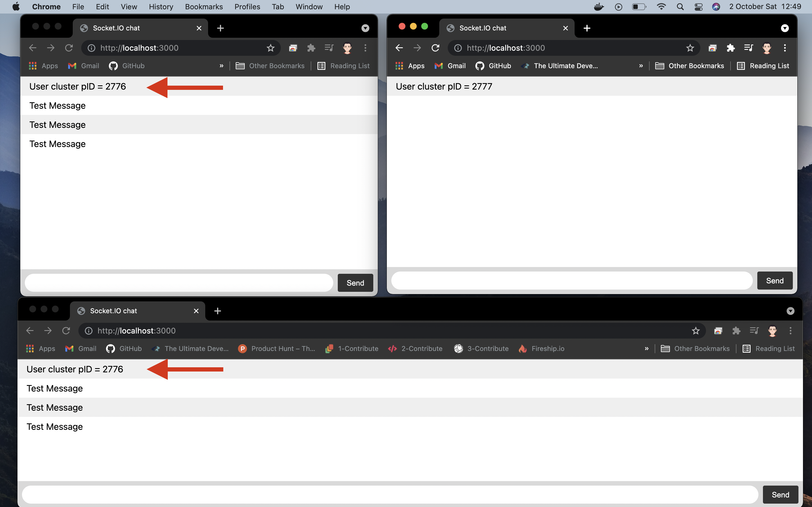
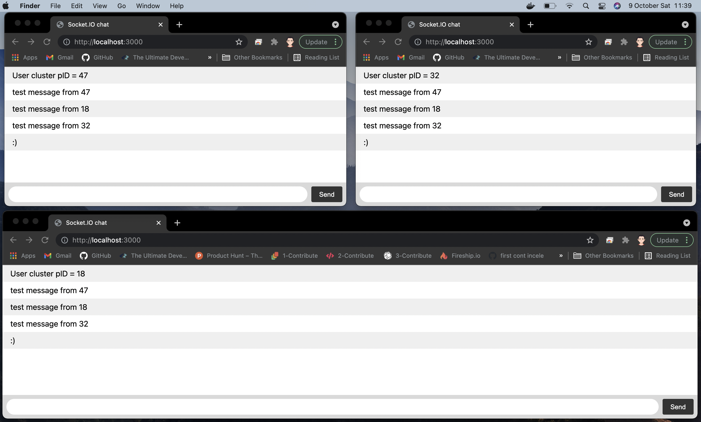

# socket io. 
Pm2 Clusters communication

## 1 - npm install

```
npm install
```
## 2 - docker compose up

```
docker compose up
```

The goal of the project is making communication between different Pm2 Clusters.

###Before :

###After :


